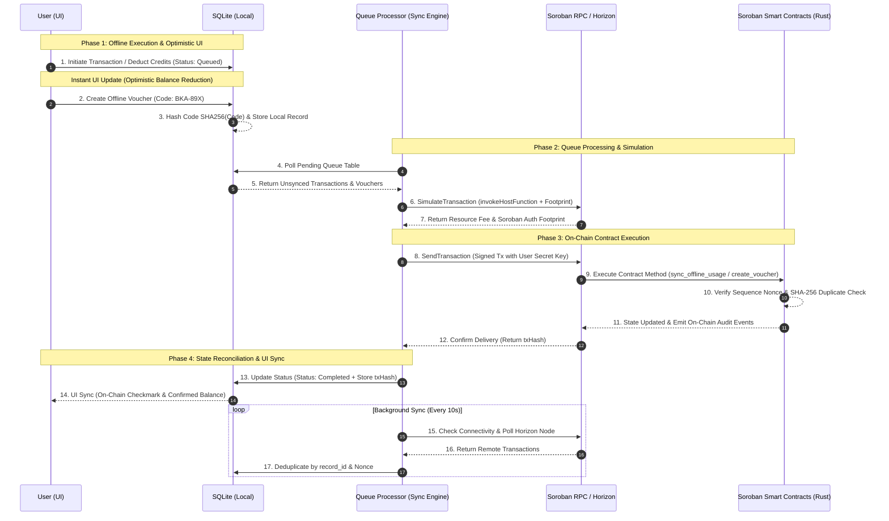
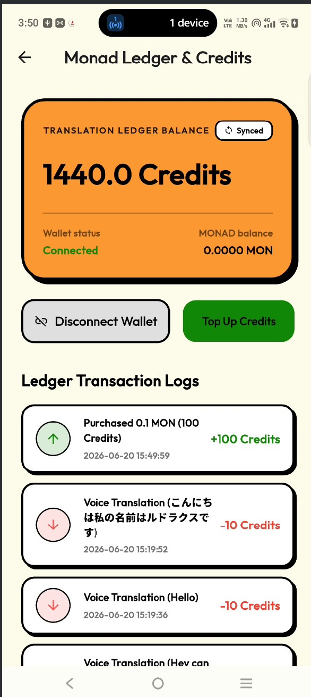

# ⚡ Bharat Ki Awaaz: Decentralized Stellar Soroban Micro-Payments & Offline-First AI Engine

> **Decentralized Stellar Soroban Smart Contracts & Offline-First Micro-Credit Settlements**

Bharat Ki Awaaz leverages **Stellar Soroban Smart Contracts** to power sub-cent, decentralized micro-credit transactions and SHA-256 hash-locked vouchers that execute seamlessly in zero-connectivity environments (rural villages, subway tunnels, highway dead zones, emergency disaster zones).

     

---

## 🏗️ How Stellar & Soroban Are Used (Sequence Architecture)

Below is the complete sequence diagram detailing how **Stellar Soroban** processes offline transaction queues, optimistic UI updates, SHA-256 hash-locked vouchers, background sync loops, sequence nonces, and smart contract invocations.



---

## 🌐 Deployed Stellar Mainnet Smart Contracts

| Contract / Account | Address / Contract ID | Stellar Expert Explorer Link | Description |
| :--- | :--- | :--- | :--- |
| **`translate_credits`** | [`CB2VC4KBEHANNPJR6TYONOXX6LYSODIAYJ37HZCC6X4BYORSRXLKGP67`](https://stellar.expert/explorer/public/contract/CB2VC4KBEHANNPJR6TYONOXX6LYSODIAYJ37HZCC6X4BYORSRXLKGP67) | [View on Explorer](https://stellar.expert/explorer/public/contract/CB2VC4KBEHANNPJR6TYONOXX6LYSODIAYJ37HZCC6X4BYORSRXLKGP67) | Custom utility token contract with offline sync (`sync_offline_usage`), nonce replay prevention, TTL extension & duplicate detection. |
| **`gift_voucher`** | [`CAPEI5YTCN3BRP6FHWDM467M5Y2YWKTM6CUYHI23UYRRYJJITKPT3GCX`](https://stellar.expert/explorer/public/contract/CAPEI5YTCN3BRP6FHWDM467M5Y2YWKTM6CUYHI23UYRRYJJITKPT3GCX) | [View on Explorer](https://stellar.expert/explorer/public/contract/CAPEI5YTCN3BRP6FHWDM467M5Y2YWKTM6CUYHI23UYRRYJJITKPT3GCX) | SHA-256 hash-locked offline voucher creation (`create_voucher`), redemption (`redeem_voucher`), and automatic refund engine. |
| **Mainnet Wallet Contract** | [`CBGMSY35IZMHNVBFQQY22PA62VWJVXIKC4TU2CTAKRGIJOACZE4EEIWW`](https://stellar.expert/explorer/public/contract/CBGMSY35IZMHNVBFQQY22PA62VWJVXIKC4TU2CTAKRGIJOACZE4EEIWW) | [View on Explorer](https://stellar.expert/explorer/public/contract/CBGMSY35IZMHNVBFQQY22PA62VWJVXIKC4TU2CTAKRGIJOACZE4EEIWW) | Primary Soroban Mainnet wallet contract integration for user keypairs. |
| **Treasury Account** | [`GAYKFM7LIRRQLGCEEP6JXBRTIZLG3DUBPKRH57ZDQJE4EJIAZ34EUTOI`](https://stellar.expert/explorer/public/account/GAYKFM7LIRRQLGCEEP6JXBRTIZLG3DUBPKRH57ZDQJE4EJIAZ34EUTOI) | [View on Explorer](https://stellar.expert/explorer/public/account/GAYKFM7LIRRQLGCEEP6JXBRTIZLG3DUBPKRH57ZDQJE4EJIAZ34EUTOI) | Protocol ecosystem treasury and liquidity pool account. |

---

## 📜 Deployed Soroban Smart Contracts (Rust Core)

### 1. `translate_credits` Contract (`contracts/translate_credits/src/lib.rs`)
* **`sync_offline_usage(env, record)`**: Validates offline translation record payloads on-chain:
  - **Authorisation:** Cryptographically requires user signature (`record.user.require_auth()`).
  - **Expiry Check:** Rejects transactions if ledger timestamp exceeds `record.expiry`.
  - **Duplicate Detection:** Verifies SHA-256 record hash (`record.record_id`) has not been processed.
  - **Sequence Nonce Verification:** Enforces strict monotonic nonces (`record.nonce == current_nonce + 1`) to eliminate replay attacks.
  - **TTL State Extension:** Automatically extends persistent storage TTL by 518,400 ledgers (~30 days).
* **`batch_sync_offline_usage(env, records)`**: Atomically syncs up to 10 offline transactions in a single invocation to optimize gas costs.

### 2. `gift_voucher` Contract (`contracts/gift_voucher/src/lib.rs`)
* **`create_voucher(creator, voucher_hash, amount, token_contract, expiry)`**: Locks translation credits into the voucher contract against a SHA-256 hash of the secret passcode.
* **`redeem_voucher(redeemer, voucher_code)`**: Calculates SHA-256 hash of the raw user code on-chain; transfers locked tokens to the redeemer upon match.
* **`refund_voucher(voucher_hash)`**: Returns locked credits to creator if the voucher expires unredeemed.

### 3. Additional Modular Contracts
* **`family_org_wallet`**: Multi-user shared vault enforcing daily spending caps per member account.
* **`marketplace`**: Decoupled voice model marketplace split (90% creator payout / 10% platform fee).
* **`subscriptions`**: Time-bound subscription management for unlimited offline translations.
* **`referrals`**: Dual 5% bonus reward distribution engine for referrers and referees.

---

## 🎯 Problem Statement (PS) & Unique Selling Proposition (USP)

### 📌 Problem Solved (PS)
* **Zero-Connectivity Blackouts:** In rural villages, subway tunnels, highway dead zones, and disaster relief sites, internet connectivity is non-existent or unreliable. Traditional cloud voice translation and Web3 dApps fail without an internet connection, locking users out of cross-lingual communication and micro-transactions.
* **Double-Spending & Replay Attacks:** Synchronizing offline micro-credit consumption to a public blockchain without exposing the network to double-spending or replay attacks.

### 💡 Unique Selling Proposition (USP)
1. **Decentralized Soroban Micro-Payments:** Cryptographic SHA-256 hash-locked vouchers, optimistic UI state updates, offline transaction queues (SQLite), and automatic background reconciliation upon reconnection.
2. **Sub-Cent Micro-Credit Settlement:** Ultra-low transaction fees powered by Stellar Soroban smart contracts with sequence nonces and cryptographic UUID verification.
3. **Offline-First Neural Voice AI Engine:** Uninterrupted real-time voice-to-voice translation across 31+ regional languages executed locally on-device via custom C++ SIMD hardware acceleration (ARM NEON).

---

## 📱 App Media & Feature Showcase

| 1. Splash | 2. Connect Wallet | 3. Onboarding | 4. Dashboard | 5. Soroban Wallet | 6. History | 7. Offline Translation |
| :---: | :---: | :---: | :---: | :---: | :---: | :---: |
|  |  |  |  |  |  |  |

---

## 🛠️ Detailed Technology Stack

* **Blockchain & Web3:** Stellar Soroban Mainnet (`stellar_flutter_sdk`, Rust Smart Contracts, WebAssembly WASM, Soroban RPC).
* **Offline Queue Persistence:** Encrypted SQLite & DatabaseHelper for transaction caching and nonce tracking.
* **Mobile App:** Flutter, Dart.
* **Native AI Core:** C++17, Dart FFI, Whisper.cpp & Gemma 2B (GGUF), ARM NEON SIMD hardware acceleration.

---

## 🚀 Quick Start & Contract Deployment

```powershell
# 1. Compile Soroban WASM Smart Contracts
cd contracts
.\build.ps1

# 2. Deploy contracts to Stellar Mainnet
.\deploy_mainnet.ps1
```

```bash
# 3. Build & Run Flutter App
flutter clean
flutter run --release
```

---
Built with 💙 for decentralized Web3 micro-settlements & seamless offline communication.
