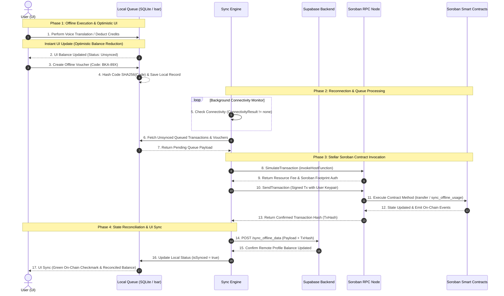

# ⚡ Bharat Ki Awaaz: Offline-First Neural Voice AI & Stellar Soroban Micro-Payments

> **Offline-First Neural Voice AI & Decentralized Stellar Soroban Micro-Payments**

Bharat Ki Awaaz enables uninterrupted voice translation across 31+ regional languages in zero-connectivity environments (rural villages, subway tunnels, highway dead zones, emergency disaster zones), paired with sub-cent micro-credit settlements powered by **Stellar Soroban Smart Contracts**.

     

---

## 🎯 Problem Statement (PS) & Unique Selling Proposition (USP)

### 📌 Problem Solved (PS)
* **Zero-Connectivity Blackouts:** In rural villages, subway tunnels, highway dead zones, and disaster relief sites, internet connectivity is non-existent or unreliable. Traditional cloud voice translation and Web3 dApps fail without an internet connection, locking users out of cross-lingual communication and micro-transactions.
* **Double-Spending & Replay Attacks:** Synchronizing offline micro-credit consumption to a public blockchain without exposing the network to double-spending or replay attacks.

### 💡 Unique Selling Proposition (USP)
1. **Offline-First Neural Voice AI Engine:** Uninterrupted real-time voice-to-voice translation across 31+ regional languages executed locally on-device via custom C++ SIMD hardware acceleration (ARM NEON).
2. **Decentralized Soroban Micro-Payments:** Cryptographic SHA-256 hash-locked vouchers, optimistic UI state updates, offline transaction queues (Isar / SQLite), and automatic background reconciliation upon reconnection.
3. **Sub-Cent Micro-Credit Settlement:** Ultra-low transaction fees powered by Stellar Soroban smart contracts with sequence nonces and cryptographic UUID verification.

---

## 🌐 Deployed Stellar Mainnet Smart Contracts

| Contract / Account | Address / Contract ID | Stellar Expert Explorer Link | Description |
| :--- | :--- | :--- | :--- |
| **`translate_credits`** | [`CB2VC4KBEHANNPJR6TYONOXX6LYSODIAYJ37HZCC6X4BYORSRXLKGP67`](https://stellar.expert/explorer/public/contract/CB2VC4KBEHANNPJR6TYONOXX6LYSODIAYJ37HZCC6X4BYORSRXLKGP67) | [View on Explorer](https://stellar.expert/explorer/public/contract/CB2VC4KBEHANNPJR6TYONOXX6LYSODIAYJ37HZCC6X4BYORSRXLKGP67) | Custom token contract with offline sync, mint, burn & nonce replay protection. |
| **`gift_voucher`** | [`CAPEI5YTCN3BRP6FHWDM467M5Y2YWKTM6CUYHI23UYRRYJJITKPT3GCX`](https://stellar.expert/explorer/public/contract/CAPEI5YTCN3BRP6FHWDM467M5Y2YWKTM6CUYHI23UYRRYJJITKPT3GCX) | [View on Explorer](https://stellar.expert/explorer/public/contract/CAPEI5YTCN3BRP6FHWDM467M5Y2YWKTM6CUYHI23UYRRYJJITKPT3GCX) | SHA-256 hash-locked offline voucher creation, redemption & refund engine. |
| **Mainnet Contract** | [`CBGMSY35IZMHNVBFQQY22PA62VWJVXIKC4TU2CTAKRGIJOACZE4EEIWW`](https://stellar.expert/explorer/public/contract/CBGMSY35IZMHNVBFQQY22PA62VWJVXIKC4TU2CTAKRGIJOACZE4EEIWW) | [View on Explorer](https://stellar.expert/explorer/public/contract/CBGMSY35IZMHNVBFQQY22PA62VWJVXIKC4TU2CTAKRGIJOACZE4EEIWW) | Primary Soroban Mainnet wallet contract integration. |
| **Treasury Account** | [`GAYKFM7LIRRQLGCEEP6JXBRTIZLG3DUBPKRH57ZDQJE4EJIAZ34EUTOI`](https://stellar.expert/explorer/public/account/GAYKFM7LIRRQLGCEEP6JXBRTIZLG3DUBPKRH57ZDQJE4EJIAZ34EUTOI) | [View on Explorer](https://stellar.expert/explorer/public/account/GAYKFM7LIRRQLGCEEP6JXBRTIZLG3DUBPKRH57ZDQJE4EJIAZ34EUTOI) | Protocol ecosystem treasury and liquidity pool account. |

---

## 🏗️ Sequence Architecture & Sync Logic

Below is the complete sequence diagram detailing how **Stellar Soroban** processes offline transaction queues, optimistic UI updates, SHA-256 hash-locked vouchers, background sync loops, and smart contract invocations.



---

## 📜 Deployed Soroban Smart Contracts (Rust)

| Contract | Location | Key Methods | Functionality |
| :--- | :--- | :--- | :--- |
| `translate_credits` | [`contracts/translate_credits`](file:///d:/Rudraksh/College/app/AI_Translator/contracts/translate_credits/src/lib.rs) | `initialize`, `mint`, `burn`, `transfer`, `sync_offline_usage`, `batch_sync_offline_usage` | Custom token contract with nonce replay prevention, TTL extension & duplicate detection. |
| `gift_voucher` | [`contracts/gift_voucher`](file:///d:/Rudraksh/College/app/AI_Translator/contracts/gift_voucher/src/lib.rs) | `create_voucher`, `redeem_voucher`, `refund_voucher` | SHA-256 hash-locked offline vouchers. |
| `family_org_wallet` | [`contracts/family_org_wallet`](file:///d:/Rudraksh/College/app/AI_Translator/contracts/family_org_wallet/src/lib.rs) | `add_member`, `withdraw`, `remove_member` | Multi-user org vault with daily member caps. |
| `marketplace` | [`contracts/marketplace`](file:///d:/Rudraksh/College/app/AI_Translator/contracts/marketplace/src/lib.rs) | `list_item`, `purchase_item` | Voice pack sales with 90% creator / 10% platform fee split. |
| `subscriptions` | [`contracts/subscriptions`](file:///d:/Rudraksh/College/app/AI_Translator/contracts/subscriptions/src/lib.rs) | `subscribe`, `is_active` | On-chain time-bound unlimited translation tiers. |
| `referrals` | [`contracts/referrals`](file:///d:/Rudraksh/College/app/AI_Translator/contracts/referrals/src/lib.rs) | `set_referrer`, `reward_purchase` | 5% referrer & referee bonus reward engine. |

---

## 🛠️ Technology Stack

* **Frontend App:** Flutter, Dart (`stellar_flutter_sdk`, `http`).
* **Native AI Core:** C++17, Dart FFI, Whisper.cpp & Gemma 2B (GGUF), ARM NEON SIMD hardware acceleration.
* **Offline Storage:** SQLite & Isar DB (Encrypted offline transaction queues, user keypairs, offline vouchers).
* **Blockchain:** Stellar Soroban (Rust Smart Contracts compiled to WebAssembly `.wasm`).
* **Cloud Database:** Supabase PostgreSQL with Row-Level Security (RLS).

---

## 🚀 Quick Start & Contract Deployment

```powershell
# 1. Compile Soroban WASM Smart Contracts
cd contracts
.\build.ps1

# 2. Deploy contracts to Stellar Mainnet
.\deploy_mainnet.ps1
```

```bash
# 3. Build & Run Flutter App
flutter clean
flutter run --release
```

---
Built with 💙 for seamless offline communication & decentralized Web3 micro-settlements.
